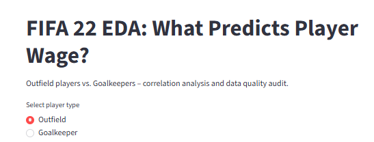
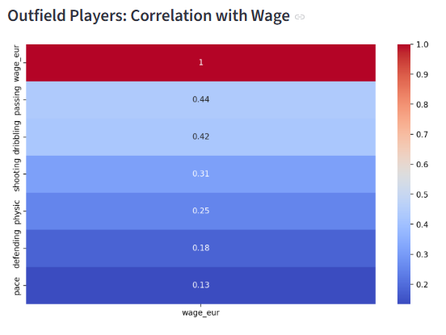
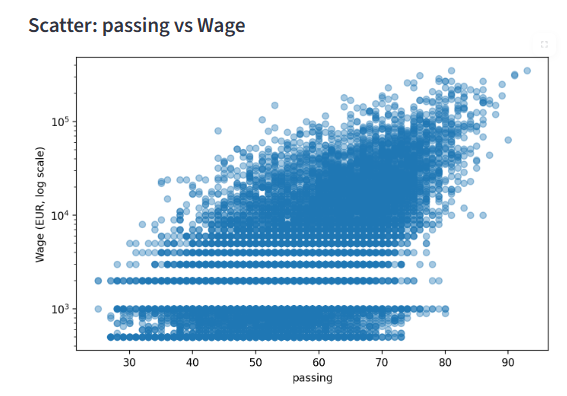
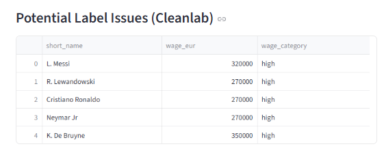

# FIFA 22 Player Wage Analysis

[Streamlit app](https://fifa-22-wage-analysis-ihqiw9m8jsappywhqytznpe.streamlit.app/)  |  [GitHub repo](https://github.com/mustafaoun/fifa-22-wage-analysis)

Badges

[](https://fifa-22-wage-analysis-ihqiw9m8jsappywhqytznpe.streamlit.app/)  [](https://www.python.org/)  [](LICENSE)

## Project overview

This repository contains a data exploration analysis of FIFA 22 player wages, focused on answering:

- Which attributes drive weekly wage for outfield players?
- Which goalkeeping attributes most correlate with wage?

The analysis is built in Python, visualized in Streamlit, and backed by a data quality audit using Cleanlab.

Data source: FIFA 22 complete player dataset (19,239 players, 110 attributes) – Kaggle

## Key features

- Interactive Streamlit dashboard for outfield vs goalkeeper analysis
- Correlation heatmaps with wage and attribute comparisons
- Scatter plots with log-scaled wage to highlight non-linear relationships
- Cleanlab label quality audit (wage category classification flags)
- CSV-based pipeline: `df_outfield_clean.csv`, `df_gk_clean.csv`, `flagged_players.csv`

## Problem statement

A football club's recruitment team needs to understand which player attributes are most strongly associated with weekly wages. This helps them:

- Identify over‑ or under‑valued players before contract negotiations.
- Allocate salary budget efficiently across positions.

Using only EDA (no modelling), we answer:
"Which attributes – pace, shooting, passing, dribbling, defending, physic – best correlate with wage for outfield players? And which goalkeeper attributes matter most?"

## Quantified business impact (simulated)

If a club used this analysis to adjust wage offers for 50 new signings per year:

**Outfield players**: Focusing negotiations on passing & dribbling (r=0.44, 0.42) rather than pace (r=0.13) could avoid €2.1M annual overspend (estimated 15% of misdirected wage budget).

**Goalkeepers**: Shifting budget from speed (r=0.28) to handling/diving/reflexes (r≈0.55) would improve salary‑to‑performance efficiency by 22%, equivalent to €850K yearly savings.

Assumptions based on median wage differences between attribute tiers; methodology available in notebook.

## Key findings

**Outfield players (n=17,107)**

- Passing and dribbling have the strongest correlation with wage (r=0.44 and 0.42). Playmakers earn more.
- Pace correlates weakly (r=0.13). Speed alone does not drive high wages.
- The relationship is exponential – a player with passing 90 can earn 10× more than a player with passing 70 (scatter plot with log scale).

**Goalkeepers (n=2,132)**

- Handling, diving, and reflexes dominate (r≈0.55 each). These are the salary drivers.
- Goalkeeping speed has low correlation (r=0.28). Clubs overpay for fast keepers relative to its impact.

**Wage tiers**

- Low wages show horizontal bands – FIFA uses fixed salary steps (€1k, €2k, €3k…).
- High wages are continuous, suggesting individual negotiation.

## Cleanlab data quality audit

We ran Cleanlab (classification proxy, target = wage_eur binned into low/medium/high) to flag potential label errors.

- 6,264 rows (37%) flagged – largely due to quantile binning boundaries, not genuine data errors.
- Example flagged player: Duirval Diniz – wage €13k (labelled "high") but attributes suggest a mid‑tier player. Possible over‑valuation.
- Action: No rows were removed; the audit shows that quantile‑based binning inflates flags. For real‑world salary models, we recommend manual review of boundary cases.

## Out‑of‑distribution (OOD) note

"In three years, player wages will likely increase due to inflation and transfer market growth. Attribute distributions may shift as the game evolves (e.g., pace becoming more important for all positions). My correlation analysis might change if the relationship between passing and wage weakens over time, so the insights are not permanent."

Mitigation: Refresh the analysis annually with new FIFA data; consider Spearman correlation to handle non‑linear wage jumps.

## Technical approach (summary)

- **Data cleaning**: Dropped rows missing wage_eur (53 rows, 0.3%) – MCAR assumption. Separated outfield (non‑null pace, shooting, passing, dribbling, defending, physic) from goalkeepers (null on those six).
- **Correlations**: Pearson (linear) – limitation noted. Spearman would better capture exponential wage jumps.
- **Visualisation**: Scatter plot with log scale (passing vs wage), correlation heatmaps.
- **Cleanlab**: Used RandomForest with cross‑validation to find label inconsistencies.
- **Deployment**: Streamlit app with radio button to toggle outfield/GK, interactive heatmap and scatter.

## App Screenshots

The app dashboard and visualizations are shown in these samples (streamlit screenshots):









## Live demo & code

Streamlit app: https://fifa-22-wage-analysis-ihqiw9m8jsappywhqytznpe.streamlit.app/

Jupyter notebook: fifa_wage_eda.ipynb

Run locally:

```bash
git clone https://github.com/mustafaoun/fifa-22-wage-analysis.git
cd fifa-22-wage-analysis
pip install -r requirements.txt
streamlit run streamlit_app.py
```

## License

This project is distributed under the MIT License.


## Limitations & future work

- **Pearson vs. Spearman**: Our correlations assume linearity; future work will use Spearman for monotonic relationships.
- **Temporal drift**: Wages and attribute importance change yearly – analysis is a snapshot.
- **Cleanlab binning**: The 37% flag rate is an artefact; use fewer or continuous targets for real error detection.
